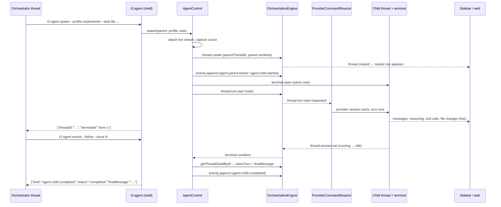

# Cross-provider agent control

Implementation plan for native orchestrator/sub-agent delegation inside T3 Code.

Status: **partially implemented.** The hierarchy foundation from §8 (persisted
`parentThreadId`, migration 035, projection plumbing, and the nested v1 sidebar) is
built and tested. Everything else — `AgentControl`, the `t3 agent` CLI, the event
feed, profiles, and the `terminal` runtime — is still plan only.

The hierarchy landed first on purpose: it is the one piece that is identical under
either answer to the open runtime decision in §16.1, so it could not be built
wrong while that decision is outstanding.

## 1. Outcome

One T3 Code thread acts as an orchestrator. It spawns sub-agent threads on _other_
providers (Claude orchestrating Codex, or the reverse), each of which:

- appears immediately in the left sidebar, **nested under its parent**;
- runs as a visible, interactive process in the desktop app — never a hidden
  background job;
- gets its own terminal in the same worktree;
- exposes its full conversation: messages, reasoning summaries, commands, tool
  calls, file changes, checkpoints, approvals, and interrupt controls;
- communicates with its orchestrator through **events**, not through injected
  prompt text.

Prompt contamination is the primary design constraint. The orchestrator drives
delegation with the shell tool it already has, via a `t3 agent` CLI. No MCP tool
schemas, no protocol preamble, and no system-prompt injection are required for
the default path.

### User flow

```
Sidebar                                Main pane
─────────────────────────────────      ──────────────────────────
▾ t3code                               orchestrator thread
  ▾ ● Ship cross-provider control        > t3 agent spawn --profile implementer …
      ● impl: server seam                  → child thread + terminal appear
      ● impl: web sidebar                > t3 agent events --follow
      ○ review: diff sweep                 → NDJSON child lifecycle events
    ● Unrelated thread
```

Clicking any nested row opens that sub-agent's ordinary T3 conversation. The user
can read it, type into it, approve for it, or interrupt it while the orchestrator
is still waiting.

## 2. Two sub-agent runtimes, one hierarchy

The goal calls for spawning terminals and forbids background tasks. Those are two
different requirements, and conflating them costs observability. The plan
separates them:

|                 | `runtime: "session"` (default)                                            | `runtime: "terminal"`                             |
| --------------- | ------------------------------------------------------------------------- | ------------------------------------------------- |
| Child process   | provider adapter session (`codex app-server`, Claude Agent SDK)           | PTY-hosted interactive CLI (`codex`, `claude`)    |
| Transcript      | full structured events — reasoning, tool calls, file changes, checkpoints | terminal output stream + parsed lifecycle markers |
| Approvals       | native T3 approval UI                                                     | in-CLI TUI                                        |
| Interrupt       | `thread.turn.interrupt`                                                   | signal / `Ctrl-C` write                           |
| Terminal        | bound terminal for shell work                                             | _is_ the terminal                                 |
| Background task | no                                                                        | no                                                |

Both are user-visible and interactive, so both satisfy "no background tasks".
`session` is the default because T3's provider adapters already produce exactly
the inspectable transcript the goal asks for
(`packages/contracts/src/providerRuntime.ts:104-133`), whereas a PTY only yields
ANSI output. `terminal` exists because it is the only way to host a provider T3
has no adapter for, and because it is what the user asked for literally.

They share one hierarchy, one event bus, one sidebar tree, and one CLI. The
runtime is a per-profile setting, so switching a profile from `session` to
`terminal` changes nothing above the `AgentControl` interface.

**Milestone 1 ships `session` only.** `terminal` is milestone 3, and §12 records
the decision if the user wants that order reversed.

## 3. Current architecture and chosen seams

Verified against this fork at `38cfc25e5`.

### 3.1 Orchestration is already provider-neutral

`OrchestrationEngineService` gives serialized, deduplicated command dispatch plus
a persisted event stream (`apps/server/src/orchestration/Services/OrchestrationEngine.ts:24-66`).
Existing commands cover everything delegation needs:

- `thread.create` — `packages/contracts/src/orchestration.ts:544-558`
- `thread.turn.start` (with a `bootstrap` shape that can create the thread and
  prepare a worktree) — `:642-687`
- `thread.turn.interrupt` — `:708-714`
- `thread.activity.append` — `:847-853`, and it is **internal-only** (`:863-872`),
  so clients cannot forge delegation lifecycle rows.

`ProjectionSnapshotQuery` reads thread shell and detail state
(`apps/server/src/orchestration/Services/ProjectionSnapshotQuery.ts:57-171`).

Both layers are already in scope for the HTTP/MCP route layer:
`OrchestrationLayerLive` is merged into `RuntimeCoreDependenciesLive`
(`apps/server/src/server.ts:287`) and `makeRoutesLayer` is provided
`RuntimeServicesLive` (`:490-491`).

### 3.2 Turn completion is derivable, but only from session state

There is no `thread.turn-completed` event. The authoritative turn-end signal is
`thread.session-set` carrying a session status that leaves `running`:
`idle`/`ready` → `completed`, `error` → `error`, `interrupted`/`stopped` →
`interrupted` (`apps/server/src/orchestration/projector.ts:50-66`, applied at
`:520-561`). `thread.turn-diff-completed` settles the turn only when the session
is no longer running (`:642-664`).

Turn ids are **provider-generated** (e.g.
`apps/server/src/provider/Layers/CodexSessionRuntime.ts:925`,
`apps/server/src/provider/Layers/ClaudeAdapter.ts:3769`), so a caller cannot know
the child's `turnId` before dispatching. Completion must be correlated through
the child thread's session lifecycle, not through a turn id supplied up front.

Turn-start failure is also observable: the reactor sets the session to `error` and
appends a `provider.turn.start.failed` activity
(`apps/server/src/orchestration/Layers/ProviderCommandReactor.ts:828-850`).

### 3.3 `streamDomainEvents` is hot — the race is real

`streamDomainEvents` is `Stream.fromPubSub(eventPubSub)`
(`apps/server/src/orchestration/Layers/OrchestrationEngine.ts:329-331`). A
consumer that subscribes after the child already finished sees nothing.

`ws.ts` already solves this exactly once, and the plan reuses the shape verbatim:
attach the live stream into a scope-bound unbounded queue **before** reading any
replay or snapshot, then emit catch-up from a captured cursor, then the buffered
live events, deduped by sequence (`apps/server/src/ws.ts:1367-1400`). Cursors come
from `engine.latestSequence` (`:336`) and replay from `engine.readEvents` (`:309-310`).

### 3.4 Thread cwd is already worktree-aware

`resolveThreadWorkspaceCwd` returns `thread.worktreePath ?? project.workspaceRoot`
(`apps/server/src/checkpointing/Utils.ts:12-28`). Copying the parent's `branch`
and `worktreePath` onto the child is sufficient for shared-worktree delegation —
no worktree preparation needed in milestone 1.

### 3.5 `dispatchBootstrapTurnStart` should not be extracted yet

The existing bootstrap workflow (`apps/server/src/ws.ts:840-1044`) is closed over
`orchestrationEngine`, `serverCommandId`, `gitWorkflow`, `refreshGitStatus`,
`projectSetupScriptRunner`, `appendSetupScriptActivity`, and
`startup.enqueueCommand`. It also does worktree creation, branch renaming, git
status refresh, and setup-script launch — none of which milestone 1 needs.

**Recommendation:** do not extract it. `AgentControl` implements a narrow
`launchChildThread` (create → record → turn.start, with a compensating
`thread.delete` if turn start fails, mirroring `cleanupCreatedThread` at
`ws.ts:851-863`). Extraction becomes worthwhile in milestone 4 when isolated
worktrees per child arrive and the two paths genuinely converge.

`AgentControl` must still route dispatch through `ServerRuntimeStartup.enqueueCommand`
(`apps/server/src/serverRuntimeStartup.ts:110-129`) so delegation cannot run
before the command gate opens.

### 3.6 Terminals can host a CLI with a contained change

Terminals are already thread-scoped with client-chosen ids, stdin writes, and an
event stream that includes `output`, `exited`, and `activity`
(`packages/contracts/src/terminal.ts:33-64`, `:199-216`).
`PtySpawnInput` already accepts `shell` + `args`
(`apps/server/src/terminal/PtyAdapter.ts:46-53`), so `runtime: "terminal"` needs
only an optional `program`/`args` on `TerminalOpenInput` threaded through
`Manager` to `spawn` — not a new subsystem.

### 3.7 There is no persistent parent-child relationship yet

`OrchestrationThread` (`packages/contracts/src/orchestration.ts:345-378`) and
`OrchestrationThreadShell` (`:401-428`) have no `parentThreadId`. Codex's own
schemas carry native subagent parent metadata, but that is provider-local and
cannot express a Claude→Codex edge.

A hierarchical sidebar is a stated requirement, so **milestone 1 does include the
schema migration.** Activity-payload-only linkage (the handoff's suggestion) is
rejected: the sidebar would have to reconstruct the tree by scanning every
thread's activity list, which is neither available in the shell snapshot nor
cheap.

Precedent for cross-thread references already exists:
`OrchestrationProposedPlan.implementationThreadId` (`:246-254`).

### 3.8 The MCP seam exists but is not the default channel

`ClaudeAdapter` injects an authenticated `t3-code` HTTP MCP server into the query
(`apps/server/src/provider/Layers/ClaudeAdapter.ts:3521`, `:3547-3559`) and
`CodexAdapter` injects the same server through CLI config overrides
(`apps/server/src/provider/Layers/CodexAdapter.ts:1397`, `:1414-1427`).
Credentials are minted per provider session by `ProviderService.prepareMcpSession`
(`apps/server/src/provider/Layers/ProviderService.ts:217-228`, called at `:593`).
`McpCapability` is currently the single literal `"preview"`
(`apps/server/src/mcp/McpInvocationContext.ts:10`) and `issue` hardcodes
`new Set(["preview"])` (`apps/server/src/mcp/McpSessionRegistry.ts:117`).

This seam is real and the plan keeps it as an **optional** front-end (§5.3), but
it is not the default, because an MCP tool puts its full schema into the
orchestrator's context on every turn — precisely the contamination the goal
rules out.

## 4. Module design

One deep module, `AgentControl`, with a small interface.

```ts
// apps/server/src/agent-control/Services/AgentControl.ts

export type AgentProfileName = string & Brand<"AgentProfileName">;

export interface AgentControlShape {
  /** Create a sub-agent thread under `parentThreadId` and start its first turn. */
  readonly spawn: (input: {
    readonly parentThreadId: ThreadId;
    readonly profile: AgentProfileName;
    readonly task: string;
    readonly title?: string;
  }) => Effect.Effect<AgentHandle, AgentControlError>;

  /** Continue an existing sub-agent this parent owns. */
  readonly send: (input: {
    readonly parentThreadId: ThreadId;
    readonly childThreadId: ThreadId;
    readonly message: string;
  }) => Effect.Effect<AgentHandle, AgentControlError>;

  /** Block until the child's in-flight turn settles, or the bound elapses. */
  readonly await: (input: {
    readonly parentThreadId: ThreadId;
    readonly childThreadId: ThreadId;
    readonly timeout?: Duration.Duration;
  }) => Effect.Effect<AgentRunResult, AgentControlError>;

  readonly interrupt: (input: {
    readonly parentThreadId: ThreadId;
    readonly childThreadId: ThreadId;
  }) => Effect.Effect<void, AgentControlError>;

  readonly list: (input: {
    readonly parentThreadId: ThreadId;
  }) => Effect.Effect<ReadonlyArray<AgentSummary>, AgentControlError>;

  /** Ordered lifecycle events for this parent's children, from a cursor. */
  readonly events: (input: {
    readonly parentThreadId: ThreadId;
    readonly fromSequenceExclusive: number;
    readonly follow: boolean;
  }) => Stream.Stream<AgentEvent, AgentControlError>;
}

export interface AgentHandle {
  readonly threadId: ThreadId;
  readonly terminalId: string | null;
  readonly profile: AgentProfileName;
}

export interface AgentRunResult {
  readonly threadId: ThreadId;
  readonly status: "completed" | "failed" | "interrupted" | "running";
  readonly finalMessage: string | null;
  readonly sequence: number;
}

export interface AgentSummary {
  readonly threadId: ThreadId;
  readonly profile: AgentProfileName;
  readonly title: string;
  readonly status: AgentRunResult["status"];
  readonly updatedAt: string;
}
```

`status: "running"` is not a failure: it is what `await` returns when its bound
elapses, so callers resume with another `await` instead of losing the child.

### What the module hides

Profile → provider-instance/model/runtime-mode resolution; child thread id
minting; workspace binding; terminal binding; fresh-vs-continued context; the
`thread.create`/`thread.turn.start` dispatch pair and its compensating delete;
the cursor-replay-live completion waiter; final-message extraction; the
per-parent concurrency cap; recursion prevention; the delegation ledger;
lifecycle activity emission; and cancellation.

### What it must not expose

Provider instance ids, MCP credentials, worktree paths, terminal PIDs, or
orchestration command shapes. Callers see thread ids, profile names, statuses,
and messages.

### Typed errors

`apps/server/src/agent-control/Errors.ts`, all `Schema.TaggedErrorClass`:

| Error                          | Raised when                                              |
| ------------------------------ | -------------------------------------------------------- |
| `AgentProfileUnknownError`     | profile is not configured and no fallback resolves       |
| `AgentProfileUnavailableError` | resolved provider instance is missing or disabled        |
| `AgentParentNotFoundError`     | parent thread is absent, archived, or deleted            |
| `AgentNotOwnedError`           | `childThreadId` was not created by this parent           |
| `AgentRecursionDeniedError`    | caller is itself a sub-agent                             |
| `AgentConcurrencyLimitError`   | parent already has the maximum live children             |
| `AgentBusyError`               | `send` targets a child with a turn already in flight     |
| `AgentLaunchFailedError`       | create succeeded, turn start failed (after compensation) |
| `AgentWaitTimeoutError`        | reserved for hard-cap breaches, not normal bound elapse  |
| `AgentDispatchError`           | wraps `OrchestrationDispatchError`                       |

## 5. Coordination channel

### 5.1 `t3 agent` CLI — the default, zero-schema path

`apps/server` already publishes a `t3` binary
(`apps/server/package.json:10-12`) with subcommands composed in
`apps/server/src/bin.ts:43-52`. `t3 project` is the exact precedent for a
subcommand that mutates orchestration state: it resolves a live server from
persisted runtime state and dispatches over the environment HTTP API, falling
back to direct SQLite when no server is running
(`apps/server/src/cli/project.ts:343-440`).

`t3 agent` follows that pattern:

```
t3 agent spawn   --profile implementer --task-file ./task.md [--title …] [--json]
t3 agent send    <threadId> --message-file ./followup.md [--json]
t3 agent await   <threadId> [--timeout 15m] [--json]
t3 agent events  [--follow] [--since <sequence>] [--child <threadId>] [--json]
t3 agent list    [--json]
t3 agent interrupt <threadId>
```

Why this satisfies "contaminate prompt as little as possible":

- The orchestrator uses its **existing** shell tool. No tool definitions, no
  resources, no prompts are added to its context by T3.
- Task and follow-up text are passed by **file path**, so orchestration plumbing
  never round-trips through the model's context.
- `--json` output is one compact object; `events` is NDJSON, one line per event.
  The orchestrator reads only what it asks for.
- Total unavoidable contamination is one line of `AGENTS.md` telling the agent the
  command exists — and even that is optional if the user says it once.

The parent thread id is **not** a CLI argument. It is derived server-side from the
caller (§9), so an orchestrator cannot impersonate another parent.

### 5.2 Events as the coordination bus

Orchestration domain events are the bus; no new transport is invented.

`AgentControl` appends internal-only `thread.activity.append` rows. Kinds follow
the existing `.started`/`.updated`/`.completed` lifecycle-rank convention that the
web timeline sorts and collapses on (`apps/web/src/session-logic.ts:1327-1338`):

On the **parent** thread:

| kind                    | tone             | payload                                                        |
| ----------------------- | ---------------- | -------------------------------------------------------------- |
| `agent.child.started`   | `tool`           | `{childThreadId, profile, title, terminalId, runtime}`         |
| `agent.child.updated`   | `tool`           | `{childThreadId, profile, phase}`                              |
| `agent.child.completed` | `tool` / `error` | `{childThreadId, profile, status, finalMessageId, durationMs}` |

On the **child** thread:

| kind                  | tone   | payload                              |
| --------------------- | ------ | ------------------------------------ |
| `agent.parent.linked` | `info` | `{parentThreadId, profile, runtime}` |

`agent.parent.linked` does double duty: it is the durable marker that survives a
T3 restart and lets recursion prevention work without in-memory state (§9).

`AgentControl.events` composes these into the `AgentEvent` stream using the
cursor-replay-live shape from §3.3, so `t3 agent events --follow --since N` never
misses an event published while the CLI was starting.

`t3 agent events` needs a pure-HTTP feed. Today the HTTP API exposes
`snapshot`, `shellSnapshot`, `threadSnapshot`, and `dispatch`
(`packages/contracts/src/environmentHttp.ts:460-490`) but no replay. Add
`GET /api/orchestration/events?fromSequenceExclusive=N&limit=M`, mirroring the
existing `orchestration.replayEvents` WS method
(`packages/contracts/src/orchestration.ts:1366-1372`). `--follow` polls it with
the returned cursor. A streaming endpoint is a later optimization, not a
milestone-1 requirement.

### 5.3 Optional MCP toolkit

For providers whose shell is sandboxed away, register an `agents` toolkit beside
the existing `preview` one, following
`apps/server/src/mcp/toolkits/preview/{tools,handlers}.ts` exactly:

```ts
run_agent({ profile, task, threadId? })     // spawn or continue, then await
agent_status({ threadId })                  // resume awaiting
```

This requires:

- `McpCapability` becomes `"preview" | "agent-control"`
  (`apps/server/src/mcp/McpInvocationContext.ts:10`).
- `requireMcpCapability` currently fails with `PreviewAutomationUnavailableError`
  (`:27-41`) — generalize to a capability-neutral error before adding a second
  capability.
- `McpSessionRegistry.issue` must stop hardcoding the capability set (`:117`).
  Add an injectable `McpCapabilityPolicy` service (default: `{preview}`) that
  `AgentControl`'s layer overrides. The policy withholds `agent-control` from any
  thread carrying `agent.parent.linked`.
- Register the toolkit in `McpHttpServer.ts:206-217` and provide orchestration
  deps where the layer is wired (`apps/server/src/server.ts:366`).

**A blocking MCP tool has a hard client-side constraint.** Claude Code enforces a
60-second per-request limit on HTTP MCP servers unless `MCP_TOOL_TIMEOUT` exceeds
60000ms, and `CLAUDE_CODE_MCP_TOOL_IDLE_TIMEOUT` aborts a call with no response or
progress notification. The vendored Effect MCP server passes only
`request.name`/`request.arguments` to handlers
(`.repos/effect-smol/packages/effect/src/unstable/ai/McpServer.ts:268-275`), so the
caller's `_meta.progressToken` is unreachable and per-request
`notifications/progress` cannot be emitted. If the MCP front-end ships, it must
also set `MCP_TOOL_TIMEOUT` and `CLAUDE_CODE_MCP_TOOL_IDLE_TIMEOUT` in
`claudeEnvironment` (`apps/server/src/provider/Layers/ClaudeAdapter.ts:3544`).

The CLI path has none of these problems, which is the second reason it is the
default.

## 6. Profile resolution

Profiles map a role name to a concrete provider configuration. They must not
carry machine-specific instance ids into the repository.

**Recommendation: `agentProfiles` in `ServerSettings`** — machine-local
`settings.json`, alongside `providerInstances`
(`packages/contracts/src/settings.ts:400-446`):

```jsonc
{
  "agentProfiles": {
    "implementer": {
      "runtime": "session",
      "instanceId": "codex",
      "model": "gpt-5.4-codex",
      "options": { "effort": "high" },
      "runtimeMode": "full-access",
      "interactionMode": "default",
    },
  },
}
```

`instanceId` is a `ProviderInstanceId` slug resolved through the instance registry
(`packages/contracts/src/providerInstance.ts:82-83`, `:124-139`).

Fallback when `implementer` is unconfigured, so the feature works on a fresh
machine without setup: pick the first **enabled** instance whose driver is
`codex`, defaulting to `defaultInstanceIdForDriver` (`:148-149`, i.e. `"codex"`),
with the model taken from the project's `defaultModelSelection` when that
selection already targets a codex-driver instance, else the driver default.
Missing or disabled → `AgentProfileUnavailableError` naming the profile, never the
instance id.

`runtimeMode` defaults to `full-access`, which starts the child with
`approvalPolicy: never` and `sandboxMode: danger-full-access`
(`docs/architecture/runtime-modes.md:5`). This is deliberate: a supervised child
would block on an approval prompt that the orchestrator cannot answer. It is also
a real privilege grant, so §9 records it as security-relevant and the profile
lets a user lower it.

Do **not** put profiles in `t3.json` (`packages/contracts/src/t3ProjectFile.ts:61-81`)
in milestone 1. A committed role→driver _intent_ map with machine-local instance
binding is a reasonable milestone 4 addition, but it doubles the resolution paths
for no milestone-1 benefit.

## 7. Lifecycle sequence

### Spawn

1. CLI resolves the caller's parent thread id server-side and calls `spawn`.
2. `AgentControl` validates: parent exists and is not archived; parent carries no
   `agent.parent.linked` (else `AgentRecursionDeniedError`); live child count is
   under the cap (else `AgentConcurrencyLimitError`).
3. Resolve the profile (§6). Mint `childThreadId`.
4. Attach the live event stream into a scope-bound queue and capture
   `engine.latestSequence`. **Before** dispatching anything (§3.3).
5. Dispatch `thread.create` with the parent's `branch` and `worktreePath`, and
   `parentThreadId` set. The child is now in the sidebar, nested.
6. Dispatch `thread.activity.append` → `agent.parent.linked` on the child, and
   `agent.child.started` on the parent.
7. Open the child's bound terminal in the same cwd.
8. Dispatch `thread.turn.start` with the task as the user message. If this fails,
   dispatch `thread.delete` for the child and fail with
   `AgentLaunchFailedError`.
9. Return `AgentHandle`. The CLI prints it and exits — the orchestrator is not
   blocked.

### Await

1. Validate ownership via `parentThreadId` on the child's projection row.
2. Attach live stream to a queue, capture cursor, replay from the cursor, dedupe
   by sequence, then drain live.
3. Terminal condition: a `thread.session-set` for the child whose session status
   is not `running`/`starting`. Map per `projector.ts:50-66` →
   `completed` | `failed` | `interrupted`.
4. Recheck `getThreadDetailById` and read `latestTurn.state` and
   `latestTurn.assistantMessageId` (`packages/contracts/src/orchestration.ts:334-343`).
   The projection recheck is what closes the residual race.
5. Extract the final message: the child message whose id equals
   `latestTurn.assistantMessageId`; fall back to the last non-streaming assistant
   message of `latestTurn.turnId`. Truncate to a configured cap. Never return the
   whole transcript.
6. Emit `agent.child.completed` on the parent.
7. On bound elapse, return `status: "running"` — do not interrupt the child.

### Definitions

| Result        | Condition                                                                               |
| ------------- | --------------------------------------------------------------------------------------- |
| `completed`   | session left `running` via `idle`/`ready`, or `turn-diff-completed` with status `ready` |
| `failed`      | session status `error`, or a `provider.turn.start.failed` activity                      |
| `interrupted` | session status `interrupted` / `stopped`; includes user interrupt from the child's UI   |
| `running`     | await bound elapsed with the turn still in flight                                       |

Provider process exit surfaces as `session.exited` → session `stopped`/`error`, so
it lands in `interrupted` or `failed` — no separate status needed.

### Sequence diagram



## 8. Sidebar hierarchy

**Implemented.** What actually shipped differs from the sketch below in two ways
worth recording:

- `parentThreadId` is `Schema.optional(Schema.NullOr(ThreadId))`, not
  `NullOr` + `withDecodingDefault`. A decoding default still leaves the field
  _required_ on the decoded type, which forced every `thread.create` construction
  site and test fixture to name it. Optional matches the `snoozedUntil` /
  `snoozedAt` precedent on the same struct and keeps the change additive; read
  sites normalize with `?? null`. Note this admits an explicit `undefined`, so
  consumer types must spell out `| undefined` under `exactOptionalPropertyTypes`.
- Per-parent collapse is **not** built. Sub-agents are indented under their
  orchestrator and orchestrator rows show a sub-agent count; collapsing a family
  moves to milestone 2 with the `SidebarV2` work.

The preview limit now counts roots via `takeSidebarThreadFamilies`, so an
orchestrator can never be separated from its own sub-agents by truncation.

### Contracts and persistence

1. `packages/contracts/src/orchestration.ts`: add
   `parentThreadId: Schema.NullOr(ThreadId)` with
   `withDecodingDefault(Effect.succeed(null))` to `OrchestrationThread` (`:345`),
   `OrchestrationThreadShell` (`:401`), `ThreadCreateCommand` (`:544`),
   `ThreadCreatedPayload` (`:940`), and
   `ThreadTurnStartBootstrapCreateThread` (`:642`). The decoding default keeps
   every persisted payload decodable, per the compatibility invariant in
   `providerInstance.ts:16-28`.
2. Migration `035_ProjectionThreadsParentThreadId.ts`, following
   `034_ProjectionThreadsSnoozed.ts` exactly: `PRAGMA table_info` guard, then
   `ALTER TABLE projection_threads ADD COLUMN parent_thread_id TEXT`. Add an index
   on `(parent_thread_id)` for child lookups.
3. `ProjectionPipeline.ts`: persist `parent_thread_id` on `thread.created`
   (around `:612`).
4. `ProjectionSnapshotQuery.ts`: add `parent_thread_id AS "parentThreadId"` to the
   thread selects (`:339`, `:371`, `:405`, `:771`) and map it in the row→entity
   builders (`:1207`, `:1409`, `:1542`, `:1680`, `:1924`, `:2022`).

`SidebarThreadSummary` is `EnvironmentThreadShell` (`apps/web/src/types.ts:56`),
which wraps `OrchestrationThreadShell` — so the field reaches the sidebar with no
extra client plumbing.

### Web rendering

`Sidebar.tsx` is the default surface; `SidebarV2.tsx` is behind the
`sidebarV2Enabled` beta flag (`apps/web/src/components/AppSidebarLayout.tsx:103-109`,
default `false` at `packages/contracts/src/settings.ts:117`). Ship v1 first, then
v2 parity.

1. `apps/web/src/components/Sidebar.logic.ts`: add
   `buildSidebarThreadTree({threads})` producing a depth-annotated, pre-order
   flattened list. Rules: children sort under their parent by the same comparator
   as roots; a child whose parent is filtered out or missing is promoted to a root
   (never dropped); depth is capped for display.
2. `getVisibleThreadsForProject` (`:626-672`) counts against the preview limit by
   **root** thread, keeping a parent's children with it rather than truncating
   mid-family.
3. `Sidebar.tsx`: `renderedThreads.map` (`:985-1017`) consumes the tree; add
   `depth` and `childCount` to `SidebarThreadRowProps` (`:304-340`) and indent
   plus render a disclosure chevron on rows with children. Persist per-parent
   collapse state alongside the existing per-project expansion state.
4. Keyboard traversal (`resolveAdjacentThreadId`, `:305`) walks the flattened tree
   so collapsed children are skipped.
5. Parent thread timeline: `agent.child.*` activities already flow into work-log
   entries with `sourceActivityKind` preserved
   (`apps/web/src/session-logic.ts:627-643`, `:677-764`). Extract `childThreadId`
   from the payload into `WorkLogEntry` (fields at `:74-80`) and render an "Open
   agent thread" affordance in `MessagesTimeline.tsx` near the existing tool-row
   rendering (`:1848-1905`), navigating to `/$environmentId/$threadId`
   (`apps/web/src/routes/_chat.$environmentId.$threadId.tsx:86`).

## 9. Security and authorization

- **Parent identity is never client-supplied.** For the CLI it is derived from the
  caller's environment/session; for the MCP front-end it comes from
  `McpInvocationContext` (`apps/server/src/mcp/McpInvocationContext.ts:12-20`).
- **Ownership.** `send`, `await`, and `interrupt` require the child's persisted
  `parentThreadId` to equal the caller's thread id → `AgentNotOwnedError`. This is
  a projection read, so it survives restarts. Arbitrary thread ids are rejected.
- **Recursion.** A thread carrying `agent.parent.linked` cannot delegate →
  `AgentRecursionDeniedError`. Because the marker is a persisted activity, this
  holds after a T3 restart, unlike an in-memory ledger. The optional MCP path
  enforces the same rule by withholding the `agent-control` capability.
- **No secret leakage.** Instance ids, MCP tokens, worktree paths, PIDs, and
  command shapes stay inside the module. Errors name profiles, not instances.
- **Privilege.** `full-access` children run with `approvalPolicy: never` and
  `sandboxMode: danger-full-access`. An orchestrator can therefore cause
  unattended writes in the shared worktree. This is the intended workflow, and it
  is why the concurrency cap and file-ownership convention in §10 are load-bearing
  rather than advisory.
- **Approvals and questions while a parent waits.** For supervised profiles the
  child's approval and structured-input requests appear in the child's own UI and
  set `hasPendingApprovals` / `hasPendingUserInput` on its sidebar row
  (`packages/contracts/src/orchestration.ts:424-425`). The orchestrator is not
  asked and cannot answer. `await` treats a pending request as still `running`;
  documented behavior for milestone 1 is that the **user** answers in the child
  thread. Forwarding approvals to the orchestrator is explicitly out of scope.
- **MCP credential idle window.** Credentials idle out after 30 minutes and expire
  at 8 hours (`apps/server/src/mcp/McpSessionRegistry.ts:55-56`); `lastUsedAt`
  refreshes only when a request is resolved (`:140-154`). Any blocking front-end
  must bound its wait below the idle window — default `await` bound **15 minutes**,
  hard cap 25 — or `McpSessionRegistry` needs a `touch` API. The CLI path is
  unaffected.

## 10. Concurrency and the shared worktree

Milestone 1 puts every child in the **parent's** worktree, which preserves
uncommitted context but allows parallel writers to clobber each other.

- **Hard cap: 3 live children per parent**, enforced in `AgentControl` before
  `thread.create`, since no orchestration invariant blocks concurrent turns
  (`apps/server/src/orchestration/commandInvariants.ts:154-168` has no such rule).
- **One in-flight turn per child.** `send` against a child whose `latestTurn.state`
  is `running` fails with `AgentBusyError` rather than racing.
- **Explicit file ownership.** The orchestrator's task text should name the files
  each child owns. This is a convention, not an enforcement — and it is worth
  saying plainly that it is the weakest part of shared-worktree mode.
- **Serialized reviewers.** Any review/fix profile runs after implementers settle,
  never concurrently with them.
- Isolated worktrees per child are milestone 4 (§11), where `prepareWorktree`
  reuse makes extracting `dispatchBootstrapTurnStart` worthwhile.

## 11. Failure and recovery

| Scenario                                    | Behavior                                                                                                                                                                                                                                                     |
| ------------------------------------------- | ------------------------------------------------------------------------------------------------------------------------------------------------------------------------------------------------------------------------------------------------------------ |
| Turn start fails after thread creation      | compensating `thread.delete`; `AgentLaunchFailedError`; no orphan row                                                                                                                                                                                        |
| Child provider crashes                      | `session.exited` → session `error`/`stopped` → `await` returns `failed`/`interrupted` with the session's `lastError`                                                                                                                                         |
| Orchestrator interrupted mid-`await`        | `await` is interruptible and leaves the child running; the child stays visible and re-attachable via `t3 agent await`                                                                                                                                        |
| User interrupts the child from T3           | existing `thread.turn.interrupt` path; `await` returns `interrupted`                                                                                                                                                                                         |
| T3 restarts mid-run                         | children are ordinary threads and rehydrate from the projection; `parentThreadId` and `agent.parent.linked` are persisted, so hierarchy, ownership, and recursion checks all survive; an in-flight `await` is lost and is re-established by calling it again |
| Await bound elapses                         | `status: "running"`; child untouched                                                                                                                                                                                                                         |
| MCP credential expires (optional front-end) | tool call 401s; the child is unaffected and still inspectable; recovery is a new turn on the parent                                                                                                                                                          |
| Orphaned child (parent deleted)             | child is promoted to a sidebar root and keeps working; ownership checks fail closed                                                                                                                                                                          |
| Terminal exits (`runtime: "terminal"`)      | `exited` event → mapped to `failed`/`completed` by exit code                                                                                                                                                                                                 |

## 12. Milestones

**Milestone 1 — tracer bullet (`session` runtime, CLI channel)**

Scope: `parentThreadId` through contracts/migration/projection; nested v1 sidebar;
`AgentControl` with `spawn`/`send`/`await`/`interrupt`/`list`/`events`; `t3 agent`
subcommands; HTTP events replay endpoint; one `implementer` profile; Codex-only
workers; shared worktree; cap 3; no recursion; bound `await`.

Acceptance:

1. An orchestrator thread runs `t3 agent spawn --profile implementer --task-file …`
   through its ordinary shell — no injected tools or prompt.
2. A fresh Codex child thread is created in the same project and worktree.
3. The child appears immediately in the sidebar, **nested under the parent**.
4. Opening it shows live messages, reasoning summaries, commands, tool calls, and
   file changes.
5. The orchestrator is never blocked; the T3 UI stays responsive.
6. `t3 agent events --follow` streams child lifecycle events as NDJSON.
7. `t3 agent await` returns child thread id, status, and final message.
8. `t3 agent send <threadId>` continues the same child with its context intact.
9. `spawn` always starts a clean child context.
10. The user can interrupt the child with existing T3 controls, and the
    orchestrator observes `interrupted`.
11. A child cannot spawn a grandchild.

**Milestone 2 — orchestrator ergonomics.** `SidebarV2` parity; child status pills
and roll-up on the parent row; "Open agent thread" affordance in the parent
timeline; `t3 agent list --json` filters; per-parent collapse persistence.

**Milestone 3 — `runtime: "terminal"`.** Optional `program`/`args` on
`TerminalOpenInput` threaded to `PtyAdapter.spawn`; PTY-hosted `codex`/`claude`
children; lifecycle derived from terminal `exited`/`activity` events; documented
loss of structured transcript relative to `session`.

**Milestone 4 — isolation and reach.** Isolated worktree per child (extract
`dispatchBootstrapTurnStart` here); additional profiles (`reviewer`, `planner`);
Claude and OpenCode as workers; optional MCP toolkit with the timeout work in
§5.3; optional committed role intent in `t3.json`.

Explicitly out of scope throughout: automatic merging or PR creation, forwarding
child approvals to the orchestrator, and any background `codex exec` process.

## 13. Test strategy

Focused, per `AGENTS.md` — smallest relevant set, no repo-wide runs.

**Server, `vp test run <files>`:**

- `agent-control/Layers/AgentControl.test.ts` — profile resolution and fallback;
  recursion denial via `agent.parent.linked`; ownership rejection; concurrency
  cap; `AgentBusyError`; compensating delete when turn start fails; final-message
  extraction from `latestTurn.assistantMessageId` and its fallback; status mapping
  for each session terminal state; bound elapse → `running`.
- **Race regression test:** publish the child's terminal `thread.session-set`
  _before_ `await` subscribes, and assert the cursor replay still resolves it.
  This is the bug the design exists to prevent, so it gets an explicit test.
- `orchestration/Layers/ProjectionSnapshotQuery.test.ts` — `parentThreadId` round
  trips through shell and detail snapshots, and defaults to `null` for pre-migration
  rows.
- `persistence/Migrations/035_*.test.ts` — idempotent re-run; existing rows get
  `NULL`; follows the `024`/`027_028` test shape.
- `cli/agent.test.ts` — flag parsing, `--json` shape, live-vs-offline mode
  selection, exit codes, and that no parent id can be passed in.

**Web, colocated Vitest:**

- `Sidebar.logic.test.ts` — tree building; stable ordering; orphan promotion when a
  parent is missing or filtered; depth capping; root-based preview limit; keyboard
  traversal across collapsed children.
- `MessagesTimeline.logic.test.ts` — `agent.child.*` activities produce a work
  entry carrying `childThreadId`.

**Contracts:** `orchestration.test.ts` — payloads without `parentThreadId` decode
to `null`.

Not run locally: repo-wide `vp check`, `vp run typecheck`, `vp run test`. Targeted
format/lint/typecheck for touched packages only.

## 14. Integrated UI verification

Required by `AGENTS.md` because the sidebar and timeline are user-visible.

Web, once per affected surface, using the `test-t3-app` skill: launch one isolated
environment, authenticate through the printed pairing URL, then in the controlled
browser:

1. Seed a project and an orchestrator thread.
2. Trigger `spawn` and confirm the child row appears **nested** under the parent
   without a reload.
3. Open the child and confirm live messages, reasoning, commands, and file changes
   render while the turn runs.
4. Confirm the parent timeline shows `agent.child.started` and that its "Open
   agent thread" affordance navigates to the child.
5. Interrupt the child from its own UI; confirm the parent's
   `agent.child.completed` reports `interrupted`.
6. Collapse and expand the parent; confirm children hide and restore and that
   keyboard traversal skips collapsed rows.
7. Repeat 2 and 6 with `sidebarV2Enabled` on once milestone 2 lands.

Stop the dev server and watchers afterward. Mobile verification
(`test-t3-mobile`) is required only once the mobile sidebar renders the hierarchy.

## 15. File and module change map

**New**

```
apps/server/src/agent-control/Services/AgentControl.ts     interface + tag
apps/server/src/agent-control/Layers/AgentControl.ts        implementation
apps/server/src/agent-control/Errors.ts                     typed errors
apps/server/src/agent-control/Profiles.ts                   profile resolution
apps/server/src/cli/agent.ts                                t3 agent subcommands
apps/server/src/persistence/Migrations/035_ProjectionThreadsParentThreadId.ts
docs/plans/cross-provider-agent-control.md                  this document
```

Optional, milestone 4:

```
apps/server/src/mcp/toolkits/agents/tools.ts
apps/server/src/mcp/toolkits/agents/handlers.ts
```

**Modified**

| File                                                              | Change                                                                    |
| ----------------------------------------------------------------- | ------------------------------------------------------------------------- |
| `packages/contracts/src/orchestration.ts`                         | `parentThreadId` on thread/shell/create-command/created-payload/bootstrap |
| `packages/contracts/src/settings.ts`                              | `agentProfiles` in `ServerSettings` + patch schema                        |
| `packages/contracts/src/environmentHttp.ts`                       | `GET /api/orchestration/events` replay endpoint                           |
| `packages/contracts/src/terminal.ts`                              | optional `program`/`args` on open (milestone 3)                           |
| `apps/server/src/orchestration/Layers/ProjectionPipeline.ts`      | persist `parent_thread_id`                                                |
| `apps/server/src/orchestration/Layers/ProjectionSnapshotQuery.ts` | select and map `parentThreadId`                                           |
| `apps/server/src/orchestration/http.ts`                           | events replay handler                                                     |
| `apps/server/src/bin.ts`                                          | register `agentCommand`                                                   |
| `apps/server/src/server.ts`                                       | provide `AgentControl` layer                                              |
| `apps/server/src/terminal/Manager.ts`                             | thread `program`/`args` to `PtyAdapter.spawn` (milestone 3)               |
| `apps/server/src/mcp/McpInvocationContext.ts`                     | second capability; capability-neutral error (optional)                    |
| `apps/server/src/mcp/McpSessionRegistry.ts`                       | injectable capability policy (optional)                                   |
| `apps/server/src/mcp/McpHttpServer.ts`                            | register `agents` toolkit (optional)                                      |
| `apps/web/src/components/Sidebar.logic.ts`                        | `buildSidebarThreadTree`; root-based preview limit; traversal             |
| `apps/web/src/components/Sidebar.tsx`                             | nested rows, depth, disclosure, collapse state                            |
| `apps/web/src/components/SidebarV2.tsx`                           | same (milestone 2)                                                        |
| `apps/web/src/session-logic.ts`                                   | surface `childThreadId` on work entries                                   |
| `apps/web/src/components/chat/MessagesTimeline.tsx`               | "Open agent thread" affordance                                            |
| `AGENTS.md`                                                       | one line documenting `t3 agent` (the only prompt-side cost)               |

**Deliberately unchanged:** `apps/server/src/ws.ts` (no bootstrap extraction in
milestone 1), all provider adapters, and the checkpoint/approval/interrupt paths.
Sub-agents are ordinary threads, so those subsystems work untouched — which is the
central reason this design is small.

## 16. Unresolved decisions

1. **Runtime priority.** The plan defaults to `runtime: "session"` because it
   preserves the structured transcript the goal asks to inspect, and schedules
   PTY-hosted agents as milestone 3. If "spawning new terminals" means literally
   _PTY-hosted CLIs first_, milestones 1 and 3 swap, milestone 1 loses structured
   reasoning/tool-call/file-change rendering for children, and completion status
   must be parsed from ANSI output. **This is the one decision that changes
   milestone 1's shape.**
2. **CLI vs MCP as the shipped channel.** The plan ships the CLI only, to hold
   prompt contamination near zero. Shipping the MCP toolkit in parallel adds tool
   schemas to every orchestrator turn plus the timeout work in §5.3.
3. **Fork destination.** `gh` is authenticated as `matias-enrique-ciber`, which
   owns no `t3code` fork, and no local fork checkout exists. This checkout's
   `origin` still points at `pingdotgg/t3code`. The fork URL/owner is needed
   before this branch can be pushed.
4. **`agentProfiles` UI.** Milestone 1 assumes hand-edited `settings.json` with a
   sane fallback. A settings panel is unscoped.
5. **Depth.** The plan allows exactly two levels (orchestrator → sub-agent) by
   denying recursion. Deeper trees need a depth budget and a cycle guard.
6. **Event retention for `--follow`.** Polling the replay endpoint is bounded by
   event-store retention. If a long-lived orchestrator can outlive retention, it
   needs a durable per-parent cursor.

```

```
